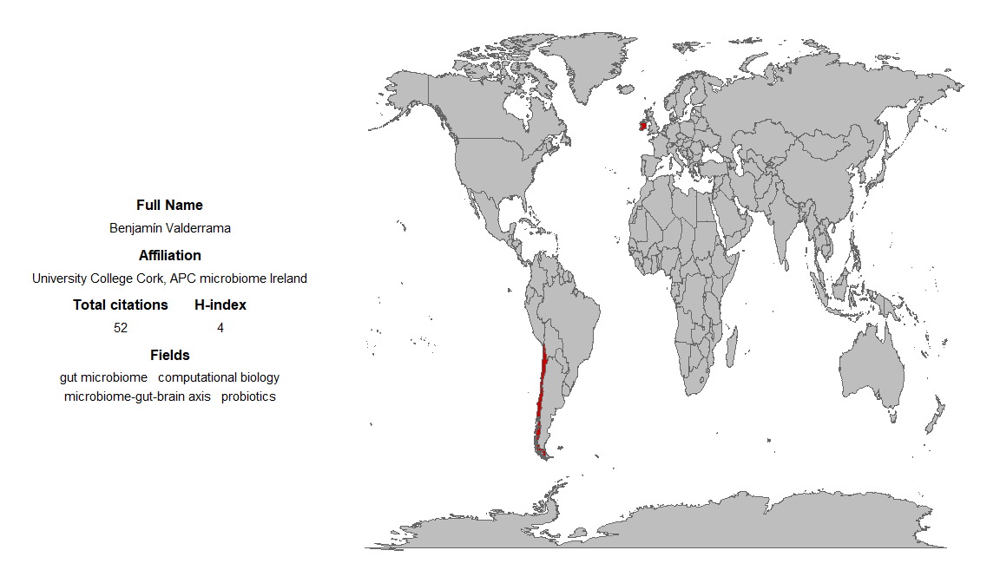
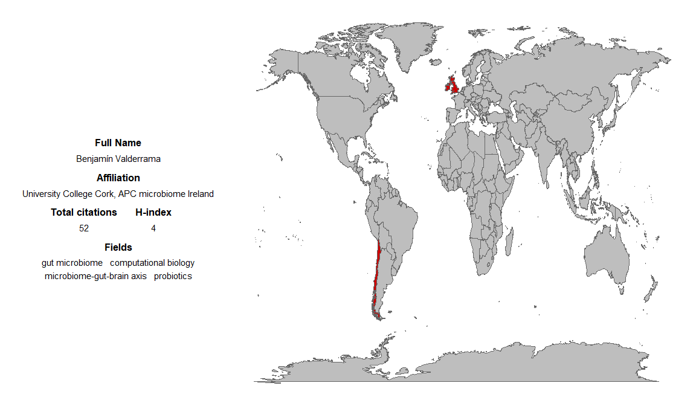

<!-- README.md is generated from README.Rmd. Please edit that file -->

# narSCIssus

<!-- badges: start -->
<!-- badges: end -->

The goal of narSCIssus is to help scientists to generate ‘business
cards’ that can be shared in their personal websites and/or social media
to showcase the impact of their research. To do so, narSCIssus uses data
from Google Scholar to generate the text of the business card, and from
PubMed to render a world map indicating countries where your current and
pasts collaborators are based on.

## Installation

You can install the development version of narSCIssus from
[GitHub](https://github.com/) with:

``` r
# install.packages("devtools")
devtools::install_github("Benjamin-Valderrama/narSCIssus")
```

## Example

Since narSCIssus uses information from PubMed, you can use advanced
queries supported by
[Entrez](https://www.ncbi.nlm.nih.gov/books/NBK3837/) to filter other
researchers with your exact (or similar) name.

In this example, I use my name followed by the Mesh Term ‘AU’ and the
keyword ‘microbiome’ to retrieve all PubMed publications where Benjamin
Valderrama is listed as an author and contain the word microbiome.

``` r
library(narSCIssus)
make_business_card("Benjamin Valderrama[AU] microbiome")
```



However, simpler queries can be made. For instace, you could use just
your name

``` r
library(narSCIssus)
make_business_card("Benjamin Valderrama")
```



Additionally, notice that by removing the keyword ‘microbiome’ from the
second search, a paper published by the author Benjamin Valderrama that
wasn’t about the topic ‘microbiome’ was included. This examples shows
that (similar but) different search terms may produce discrepant
results, thus users should be use search terms with caution.

## Further development

I wrote narSCIssus during my holidays as an small experiment. However, I
do want to add some features. I share my ideas here -mostly- to keep me
accountable :joy:

- Make shiny app for narSCIssus
- Allow users to provide affiliations to narrow down ambiguous Google
  Scholar searches
